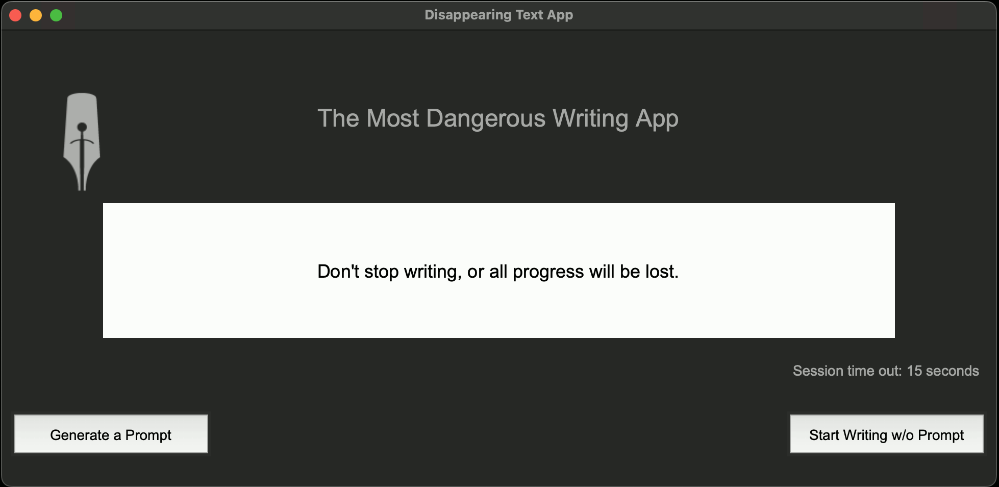
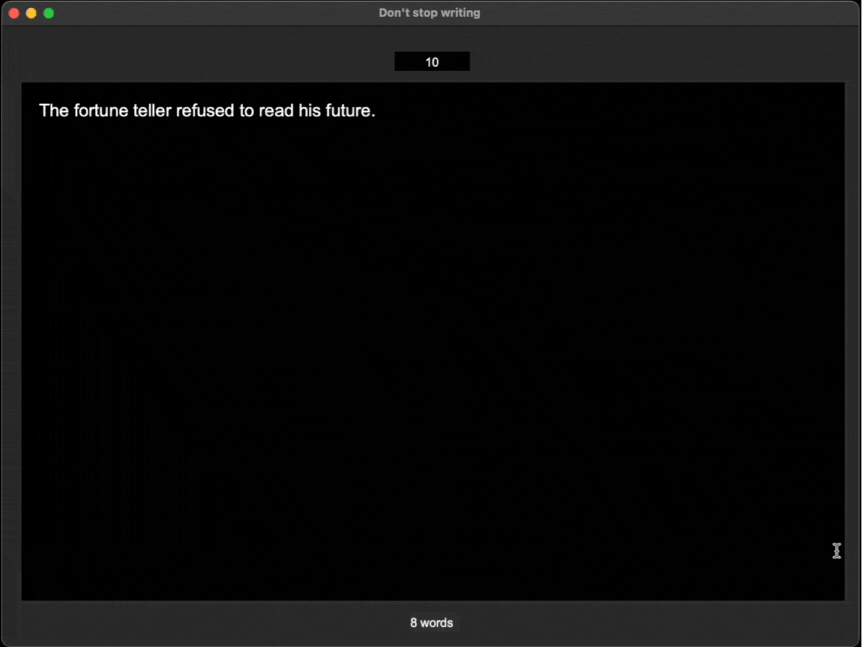

# disappearing-text
A Python and Tkinter-based desktop application designed to help authors with writers block.<br> Once you start the app you can select a prompt if desired (optional) and a session time out (again optional - default is set to 15 seconds), you can begin typing. <br>
Onve you gave started, if you do not keep typing, then after the selected session time out, number of seconds of inactivity allowed, the text will be deleted. As a warning indication, 10 seconds before the time out the text begins to fade. The app has a selection of starting prompts saved in a text file, which it can randomly serve up as inspiration to start writing.

<br>
Selecting the session time out, (by clicking on the text above the 'Start Writing' button), and generating a random prompt, (by clicking on the 'Generate Prompt' button).

<br>
<br>
Using the 'Don't stop writing' window in the app, as long as you keep typing, then the text remains visible. But if you stop typing, then after a time the text will slowly dim and vanish when the Time Out is reached! An interactive Word count is displayed at the bottom of the screen, and count down timer at the top.

<br>

#
<!-- TABLE OF CONTENTS -->
<details>
  <summary>Table of Contents</summary>
  <ol>
    <li><a href="#Features">Features</a></li>
    <li>
      <a href="#installation">Installation</a>
      <ul>
        <li><a href="#prerequisites">Prerequisites</a></li>
        <li><a href="#steps">Steps</a></li>
      </ul>
    </li>
    <li><a href="#how-to-use-the-app">How to use the app.</a></li>
    <li>
        <a href="#contributing">Contributing</a>
      <ul>
        <li><a href="#fork-the-repository">Fork the repository</a></li>
      </ul>
    </li>
    <li><a href="#license">License</a></li>
    <li><a href="#acknowledgements">Acknowledgements</a></li>
  </ol>
</details>

<!-- FEATURES -->
## Features

- Optional Prompt for writing (if desired).
- AI generated Prompts, delivered at random from a list of 250 pre-created texts.
- Ability to select session time out from a choice of 10,15,20,25 or 30 seconds, with a default of 15 seconds.
- A writing screen for text entry, with metrics displayed.
- Timer and Word count display to track your progress.
  - Count down timer to remind you to keep typing.
  - Word count to show progress.
- Disappearing Text begins to fade 10 seconds prior to Time Out.
- Saves text to log file on:
  - Closing of the Text Entry Screen window.
  - At Time Out, after a set time of typing inactivity, selected for the session.

<!-- INSTALLATION -->
## Installation
#### Prerequisites
* Python 3.x installed on your machine.
* (Optional) A virtual environment for isolated dependencies.


### Steps
1. Clone this repository:

```bash
git clone https://github.com/Garschke/disappearing-text.git
```
2. (Optional) Create and activate a virtual environment:
```bash
python3 -m venv .venv
source .venv/bin/activate   # On Windows use: .venv\Scripts\activate
```
3. Install dependencies (if any):
```bash
pip install -r requirements.txt
```

## How to use the app

1. Run the disappearing-text.py file:

```bash
python3 disappearing-text.py  # Mac & Linux
python disappearing-text.py   # PC
```

2. On the initial screen you can decide if you would like to have a helper prompt text to start you off writing or if you would like to start with a blank canvas.

3. If you decide to go for a prompt, when you click the prompt button you will be provide with an opening piece of text, you can either go with that or press the prompt button again for a new opening prompt.

4. With either an opening prompt or a blank canvas you then click on the start writing button to take you to the text entry screen.

5. Type your text, and keep going.  You can monitor your word count at the bottom of the screen, and see the inactivity count down timer at the top.

6. If you want to save the text you can close down the window.

7. If you let the timer decrease, then 10 seconds before Time out the text will begin to fade, at time out the text vanishes from the screen, it is saved and deleted from the text window. And you get a message to let you know that you Timed Out!

#### 🎉  Enjoy the app, feel inspired to write and have fun!

## Contributing
Contributions are welcome!

### Fork the repository
1. Create your feature branch: git checkout -b feature/NewFeature
2. Commit your changes: git commit -m 'Add new feature'
3. Push to the branch: git push origin feature/NewFeature
4. Open a pull request.

## License
This project is licensed under the MIT License - see the LICENSE file for details.

## Acknowledgements

- [Tkinter](https://docs.python.org/3.12/library/tkinter.html) - The standard Python interface to the Tcl/Tk GUI toolkit used in this app.
- [Squibler's web based app](<https://www.squibler.io/dangerous-writing-prompt-app>) - Inspiration for this Python Desktop app.